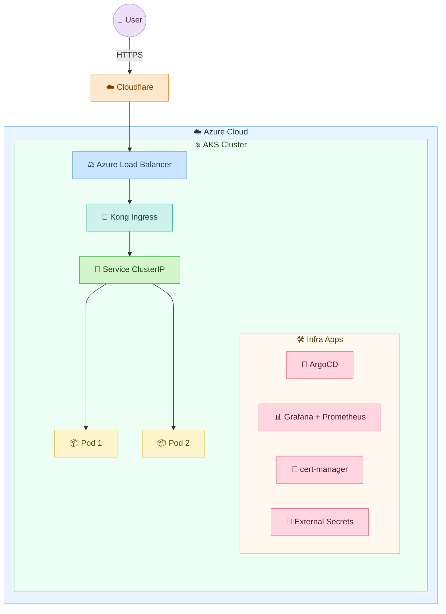
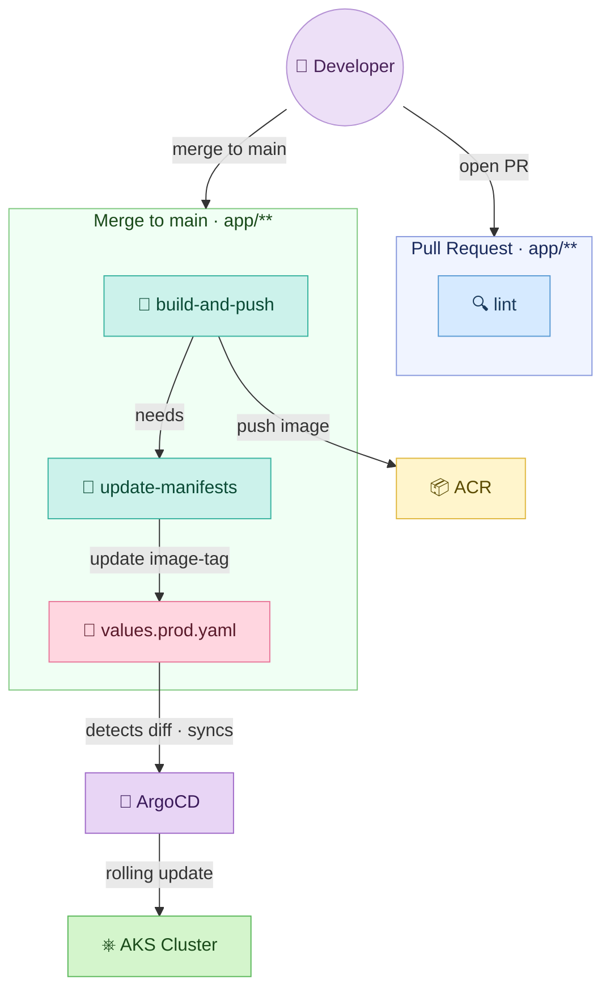
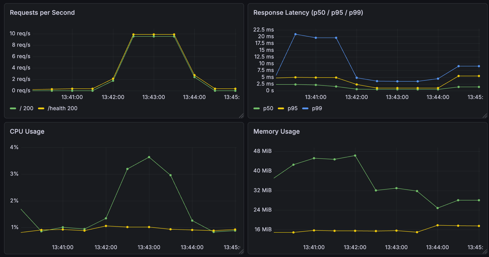
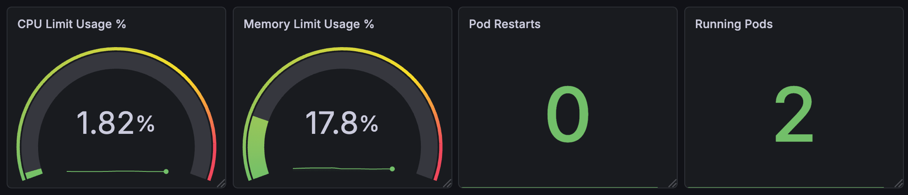

# Azure-web-app

A minimal Node.js HTTP application containerised with Docker and deployed to a private Azure Kubernetes Service (AKS) cluster. Infrastructure is fully managed with Terraform, images are built and pushed by GitHub Actions using OIDC (zero stored secrets), and ArgoCD handles GitOps-based deployment by watching `infra/argocd/applications/azure-web-app/values.prod.yaml` for changes.

---

> **Live endpoints**
>
> | Endpoint | Description |
> |---|---|
> | `http://azure-web-app.57.162.240.11.nip.io/` | Hello World response |
> | `http://azure-web-app.57.162.240.11.nip.io/health` | JSON health payload |

---

## Overview

- **Application** — Node.js + TypeScript + Express
- **Container** — Docker (multi-stage, Alpine, non-root)
- **Infrastructure** — Terraform (modular, Azure)
- **Kubernetes** — AKS (private cluster, Azure CNI)
- **Image registry** — Azure Container Registry (managed identity pull)
- **Kubernetes packaging** — [Helm](https://helm.sh/docs/)
- **GitOps / CD** — [ArgoCD](https://argo-cd.readthedocs.io/en/stable/) (App of Apps)
- **CI** — GitHub Actions (OIDC — zero stored secrets)
- **Ingress** — [Kong Ingress Controller](https://docs.konghq.com/kubernetes-ingress-controller/latest/)
- **Monitoring** — [Grafana](https://grafana.com/docs/grafana/latest/) + [Prometheus](https://prometheus.io/docs/introduction/overview/)

---

## Architecture



### Azure Resources

- **Resource Group** `azure-web-app` — container for all resources
- **Virtual Network** `azure-web-app-vnet` — private network (10.0.0.0/8)
- **Subnet** `aks-nodes` — AKS node subnet (10.240.0.0/16)
- **Container Registry** `imageregistryyy` — stores Docker images
- **AKS Cluster** `prod-aks-1` — private Kubernetes cluster
- **Managed Identity** `prod-aks-1-kubelet-identity` — AcrPull, passwordless image pull from nodes
- **Managed Identity** `github-ci-identity` — GitHub Actions → ACR push via OIDC

---

## Repository Structure

```
azure-web-app/
├── app/                        # Node.js application + Dockerfile
├── infra/
│   ├── argocd/                 # ArgoCD App of Apps manifests
│   ├── helm/                   # Generic Helm chart
│   ├── terraform/              # Azure infrastructure (modular)
│   └── scripts/                # Bootstrap utilities
├── monitoring/
│   └── dashboard.json          # Grafana dashboard JSON
└── .github/workflows/
    └── build-and-deploy.yml    # CI/CD pipeline
```

---

## Codebase

```
app/
├── src/
│   ├── index.ts        # Entry point — imports app from server.ts and calls .listen()
│   └── server.ts       # Express app setup, routes, metrics (exports app for testing)
├── Dockerfile          # Multi-stage, Alpine, non-root
├── docker-compose.yml  # Local development
├── eslint.config.js    # ESLint flat config (TypeScript)
├── tsconfig.json       # TypeScript config
├── package.json
└── package-lock.json
```

### Prerequisites

- **Docker** >= 24
- **Node.js** >= 22
- **TypeScript** >= 5 (`npm install` installs it locally via devDependencies)

### Endpoints

- `GET /` — `200` plain-text `Hello World from Azure AKS!`
- `GET /health` — `200` JSON health payload
- `GET /metrics` — Prometheus metrics (Node.js runtime via `collectDefaultMetrics`)

```json
{
  "status": "healthy",
  "version": "be4c9e3",
  "env": "production",
  "uptime": 4919.02,
  "timestamp": "2026-05-20T14:24:51.142Z"
}
```

### Best Practices

- **Multi-stage Docker build** — builder stage compiles TypeScript and installs all deps; runtime stage copies only `dist/` and production `node_modules`, keeping the final image minimal
- **Non-root container** — dedicated `appuser` account, no privilege escalation, all Linux capabilities dropped
- **Read-only root filesystem** — container filesystem is immutable at runtime
- **Dedicated health endpoint** — `/health` returns structured JSON used by Kubernetes liveness and readiness probes
- **Graceful shutdown** — `SIGTERM` handler closes the HTTP server cleanly before exiting, giving Kubernetes time to drain connections
- **Testable server** — `src/server.ts` exports the Express app without calling `.listen()`, so integration tests can import it without binding to a port

---

## Local Setup

Pick your preferred way to run the app:

- [Docker & Docker Compose](#docker--docker-compose) — fastest, no Kubernetes required
- [Kind Cluster](#kind-cluster) — local Kubernetes with Helm
- [IaC (Terraform + AKS)](#infra-provisioning) — full Azure deployment

---

### Docker & Docker Compose

**Prerequisites:** Docker >= 24 or Node.js >= 22

```bash
git clone <repo-url> && cd azure-web-app

# TypeScript dev mode (no compile step)
cd app && npm install && npm run dev

# Or with Docker Compose
cd app && docker compose up --build
```

Open `http://localhost:3000/` and `http://localhost:3000/health`.

---

### Kind Cluster

**Prerequisites:**

- [Docker](https://docs.docker.com/get-docker/) >= 24
- [kind](https://kind.sigs.k8s.io/)
- [kubectl](https://kubernetes.io/docs/tasks/tools/)
- [Helm](https://helm.sh/docs/intro/install/)
- [Kong Ingress Controller](https://docs.konghq.com/kubernetes-ingress-controller/latest/get-started/) installed in the cluster

#### 1. Create cluster

```bash
kind create cluster --name azure-web-app
kubectl cluster-info --context kind-azure-web-app
```

#### 2. Build and load image

```bash
docker build -t azure-web-app:local ./app
kind load docker-image azure-web-app:local --name azure-web-app
```

#### 3. Deploy the app via Helm

```bash
helm upgrade --install azure-web-app infra/helm/ \
  --set image.repository=azure-web-app \
  --set image.tag=local \
  --set image.pullPolicy=Never \
  --set ingress.enabled=true \
  --set ingress.className=kong \
  --set ingress.host=localhost
```

#### 4. Test

```bash
kubectl port-forward -n kong svc/kong-gateway-proxy 8080:80
curl http://localhost:8080/
curl http://localhost:8080/health
```

#### 5. Tear down

```bash
kind delete cluster --name azure-web-app
```

---

## Terraform

```
infra/terraform/
├── main.tf / variables.tf / outputs.tf / providers.tf
├── modules/
│   ├── vnet/       # Virtual Network
│   ├── acr/        # Azure Container Registry
│   ├── identity/   # Managed Identities (kubelet + GitHub CI)
│   ├── aks/        # AKS Cluster
│   └── oidc-role/  # OIDC federated credential for GitHub Actions
└── environments/
    └── prod/
        ├── terraform.tfvars   # Environment config
        └── secrets.tfvars     # SP credentials (git-ignored)
```

### Prerequisites

- **Terraform** >= 1.6
- **Azure CLI** logged in (`az login`)
- **Azure Service Principal** with Contributor role on the target subscription — this is used only for the initial `terraform apply` to bootstrap the infrastructure. After provisioning, CI/CD uses a dedicated Terraform managed identity (created by the `oidc-role` module) scoped to the resource group with Contributor + a custom role for role assignments.

---

### Infra-Provisioning

#### 1. Bootstrap remote state

Choose one option to create the Azure Storage backend for Terraform state.

**Option 1 — Manual**

```bash
az group create --name tfstate-rg --location eastus

az storage account create \
  --name <unique-storage-name> \
  --resource-group tfstate-rg \
  --sku Standard_LRS \
  --kind StorageV2 \
  --min-tls-version TLS1_2 \
  --allow-blob-public-access false

az storage account blob-service-properties update \
  --account-name <unique-storage-name> \
  --resource-group tfstate-rg \
  --enable-versioning true

az storage container create \
  --name tfstate \
  --account-name <unique-storage-name> \
  --auth-mode login
```

**Option 2 — Script** ([`infra/scripts/bootstrap-tfstate.sh`](infra/scripts/bootstrap-tfstate.sh))

```bash
bash infra/scripts/bootstrap-tfstate.sh
```

After either option, update `infra/terraform/providers.tf` with the storage account name.

#### 2. Configure credentials

Fill in your Service Principal values in `infra/terraform/environments/prod/secrets.tfvars` (git-ignored):

```hcl
subscription_id = "<your-subscription-id>"
tenant_id       = "<your-tenant-id>"
client_id       = "<your-client-id>"
client_secret   = "<your-client-secret>"
```

Create a Service Principal if you don't have one:

```bash
az ad sp create-for-rbac --name azure-web-app-tf --role Contributor \
  --scopes /subscriptions/<subscription-id>
```

#### 3. Configure environment

Review and update `infra/terraform/environments/prod/terraform.tfvars` with values for your environment. Key variables to check:

```hcl
# ── Global ────────────────────────────────────────────────────────────────────
location            = "eastus"
resource_group_name = "azure-web-app"
environment         = "prod"

# ── ACR ───────────────────────────────────────────────────────────────────────
acr_name = "<globally-unique-acr-name>"     # 5-50 lowercase alphanumeric
acr_sku  = "Basic"                          # Basic, Standard, or Premium

# ── AKS ───────────────────────────────────────────────────────────────────────
cluster_name            = "prod-aks-1"
kubernetes_version      = "1.35.4"          # check: az aks get-versions -l eastus
node_vm_size            = "Standard_DC2as_v5"
private_cluster_enabled = true

# ── GitHub OIDC ───────────────────────────────────────────────────────────────
github_org  = "<your-github-org>"
github_repo = "<your-repo-name>"
```

See `infra/terraform/variables.tf` for the full list of configurable variables and their descriptions.

#### 4. Apply

```bash
cd infra/terraform

terraform init -backend-config="key=environments/prod/terraform.tfstate"
terraform plan  -var-file="environments/prod/terraform.tfvars" -var-file="environments/prod/secrets.tfvars"
terraform apply -var-file="environments/prod/terraform.tfvars" -var-file="environments/prod/secrets.tfvars"
```

> **Note:** The AKS cluster is private — the API server has no public endpoint. To run `kubectl` commands after provisioning, set up an [Azure Bastion host](https://learn.microsoft.com/en-us/azure/bastion/bastion-overview) or a VPN gateway with access to the cluster's VNet, or use `az aks command invoke` to tunnel commands through the Azure API.

#### 5. Export GitHub Actions secrets

```bash
terraform output github_actions_setup
```

Add the printed values as Actions Secrets in `GitHub → Settings → Secrets and variables → Actions → Secrets`.

#### 6. Bootstrap ArgoCD

After the cluster is provisioned and you have `kubectl` access:

```bash
# Install ArgoCD (if not already installed)
kubectl create namespace argocd
kubectl apply -n argocd -f https://raw.githubusercontent.com/argoproj/argo-cd/stable/manifests/install.yaml

# If the repo is private, configure ArgoCD with repo credentials:
argocd repo add https://github.com/<org>/<repo> --username <user> --password <PAT>

# Apply the root App of Apps — this is the only manual kubectl apply needed
kubectl apply -f infra/argocd/apps/root-app.yaml

# Verify the root app syncs and creates child applications
argocd app list
```

ArgoCD will automatically detect and deploy all Application manifests under `infra/argocd/applications/`.

### Best Practices

- **Modular structure** — each Azure resource (VNet, ACR, AKS, Identity, OIDC) lives in its own module with isolated inputs and outputs
- **Remote state** — state stored in Azure Blob Storage with per-environment state keys, preventing local state drift
- **Sensitive variables** — SP credentials declared with `sensitive = true` and stored in a git-ignored `secrets.tfvars`, never committed
- **Private AKS cluster** — API server has no public endpoint; access tunnelled via Azure API
- **No `az login` in CI** — `azurerm` provider reads `ARM_*` environment variables directly, keeping the pipeline credential-free

---

## Helm Chart and ArgoCD

### Helm Chart

```
infra/helm/
├── Chart.yaml                  # Chart metadata — name, version, appVersion
├── values.sample.yaml          # Reference config — copy and customise for your env
└── templates/
    ├── _helpers.tpl            # Named template helpers (fullname, labels, selectors)
    ├── deployment.yaml         # Deployment workload
    ├── service.yaml            # ClusterIP Service wiring pods to the Ingress
    ├── ingress.yaml            # Kong Ingress rule (toggle: ingress.enabled)
    ├── hpa.yaml                # Horizontal Pod Autoscaler (toggle: autoscaling.enabled)
    ├── pdb.yaml                # Pod Disruption Budget for rolling-update safety (toggle: podDisruptionBudget.enabled)
    ├── networkpolicy.yaml      # Default-deny ingress + allow from Kong namespace (toggle: networkPolicy.enabled)
    ├── configmap.yaml          # Non-sensitive app configuration mounted as env vars
    ├── externalsecret.yaml     # External Secrets Operator — pulls secrets from Azure Key Vault (toggle: externalSecret.enabled)
    ├── serviceaccount.yaml     # Dedicated ServiceAccount with optional Workload Identity annotations
    └── servicemonitor.yaml     # Prometheus ServiceMonitor for scraping /metrics (toggle: serviceMonitor.enabled)
```

### ArgoCD

```
infra/argocd/
├── apps/
│   └── root-app.yaml            # Bootstrap — apply once
└── applications/
    ├── appproject.yaml           # AppProject — restricts repos, namespaces, and allowed resources
    └── azure-web-app/
        ├── prod-app.yaml        # ArgoCD Application → infra/helm/
        └── values.prod.yaml     # Environment-specific overrides
```

### Prerequisites

- **Helm** >= 3.12 — [official docs](https://helm.sh/docs/)
- **kubectl** >= 1.29
- **ArgoCD** installed in the cluster — [official docs](https://argo-cd.readthedocs.io/en/stable/getting_started/)
- **Kong Ingress Controller** installed in the cluster — [official docs](https://docs.konghq.com/kubernetes-ingress-controller/latest/get-started/)
- **ArgoCD CLI** (optional) — [official docs](https://argo-cd.readthedocs.io/en/stable/cli_installation/)


### Helm Features

The chart is generic — all features are off by default and toggled via `infra/argocd/applications/azure-web-app/values.prod.yaml`.

- `deployment.yaml` — always
- `ingress.yaml` — `ingress.enabled: true`
- `hpa.yaml` — `autoscaling.enabled: true`
- `pdb.yaml` — `podDisruptionBudget.enabled: true`
- `networkpolicy.yaml` — `networkPolicy.enabled: true`
- `servicemonitor.yaml` — `serviceMonitor.enabled: true`

```bash
# Dry-run with deployment config
helm template azure-web-app infra/helm/ -f infra/argocd/applications/azure-web-app/values.prod.yaml | grep "^kind:"
```

### Best Practices

- **App of Apps pattern** — a single `root-app.yaml` bootstrap apply manages all child ArgoCD Applications, avoiding manual per-app installs
- **AppProject** — dedicated `azure-web-app` project restricts source repos, destination namespaces, and allowed resource kinds; production apps should not run in the `default` project
- **GitOps** — the CI pipeline never calls `kubectl`; all cluster state is declared in Git and reconciled by ArgoCD
- **All features off by default** — every optional resource (HPA, PDB, Ingress, NetworkPolicy, ServiceMonitor, ExternalSecret) is disabled unless explicitly toggled in values
- **External Secrets over native Secrets** — secrets are pulled from Azure Key Vault via the External Secrets Operator; no plaintext secrets in Git
- **`values.sample.yaml`** — the chart ships a fully-documented reference values file; environment overrides live separately in `values.prod.yaml`

---

## CI/CD Pipeline

```
.github/workflows/
└── build-and-deploy.yml
```

### Prerequisites

The pipeline uses OIDC — no stored credentials needed. Set these as **Actions Secrets** in `GitHub → Settings → Secrets and variables → Actions → Secrets`:

- `AZURE_TENANT_ID` — Azure AD tenant ID
- `AZURE_SUBSCRIPTION_ID` — Azure subscription ID
- `AZURE_CLIENT_ID` — Client ID of the `github-ci-identity` managed identity
- `ACR_LOGIN_SERVER` — ACR login server, e.g. `imageregistryyy.azurecr.io`

> Values are printed by `terraform output github_actions_setup` after provisioning.

### Triggers

| Event | Path filter | Jobs run |
|---|---|---|
| Pull request → `main` | `app/**` | `lint` only |
| Push (merge) → `main` | `app/**` | `build-and-push` → `update-manifests` |



**Job: `lint`** (on every PR)
- Runs `npm ci` then `npm run lint` via ESLint and `npm run typecheck`
- Blocks merge if linting or type checking fails

**Job: `build-and-push`** (on merge to `main` only)
- Logs in to Azure via OIDC (no stored credentials)
- Builds the Docker image with `APP_VERSION=<7-char SHA>` build arg
- Pushes to ACR tagged with the git SHA and `latest`, with layer cache

**Job: `update-manifests`** (runs after `build-and-push`)
- Updates `image.tag` in `infra/argocd/applications/azure-web-app/values.prod.yaml` via `yq`
- Commits and pushes with `[skip ci]` to prevent a loop

ArgoCD detects the commit to `infra/argocd/applications/azure-web-app/values.prod.yaml` and applies a rolling update. The pipeline never calls `kubectl` — the cluster is fully GitOps-managed.

### Best Practices

- **OIDC authentication** — GitHub Actions authenticates to Azure via federated identity; no client secrets stored in GitHub
- **OIDC secrets scoped to job** — `AZURE_CLIENT_ID`, `AZURE_TENANT_ID`, and `AZURE_SUBSCRIPTION_ID` are set as job-level env vars only on the `build-and-push` job, not exposed workflow-wide
- **Immutable image tags** — every image is tagged with the 7-char git SHA; `latest` is also pushed for cache but never used in deployments
- **Registry layer cache** — `cache-from` / `cache-to` via ACR `buildcache` tag cuts build times on repeated runs
- **`[skip ci]` commits** — manifest-update commits include `[skip ci]` to prevent the pipeline re-triggering itself in a loop
- **Lint gate on PR** — ESLint and TypeScript type checking run on every pull request; the build and push jobs only run on merge to `main`
- **Path-scoped triggers** — workflow only fires when files under `app/` change, avoiding unnecessary runs for docs or infra changes
- **Concurrency control** — `concurrency: group` cancels in-progress runs on the same ref when a new push arrives
- **Job timeouts** — `timeout-minutes: 15` on all jobs prevents hung builds from consuming runners indefinitely

---

## Monitoring

Grafana and Prometheus are installed in the cluster and scrape the app's `/metrics` endpoint via a `ServiceMonitor`. The dashboard JSON is at `monitoring/dashboard.json`.

> **Note:** Grafana and Prometheus are currently installed via manual Helm installs. Automating their deployment via ArgoCD App of Apps is a planned future improvement.

### Prerequisites

- **Prometheus** — must be running in the cluster and configured to scrape app pods. The Helm chart includes a `ServiceMonitor` (`serviceMonitor.enabled: true`) that the Prometheus Operator uses to auto-discover pods exposing `/metrics`. Prometheus datasource UID must be set to `prometheus` for the dashboard to wire up correctly. [official docs](https://prometheus.io/docs/introduction/overview/)
- **Grafana** — add Prometheus as a datasource (UID: `prometheus`) before importing the dashboard. [official docs](https://grafana.com/docs/grafana/latest/)

### Importing the Dashboard

In Grafana: **Dashboards → Import → Upload JSON file**, select `monitoring/dashboard.json`, and pick your Prometheus datasource. The dashboard covers request rate, latency, CPU/memory usage, pod restarts, and running pod count.




### Best Practices

- **ServiceMonitor** — Prometheus Operator discovers app pods automatically via the `ServiceMonitor` CRD; no static scrape config needed
- **Prometheus datasource UID** — UID is pinned to `prometheus` in the dashboard JSON so it wires up correctly without manual re-linking after import
- **Dashboard as code** — the Grafana dashboard is version-controlled at `monitoring/dashboard.json`, making it reproducible across environments

---

## Future Improvements

- **TLS via cert-manager** — wire up cert-manager with a Let's Encrypt ClusterIssuer to serve HTTPS traffic; the Helm chart already supports TLS configuration in the ingress template
- **Terraform CI** — automate `terraform plan` on PR and `terraform apply` on merge via GitHub Actions, mirroring the app pipeline
- **Multi-regional setup** — deploy the AKS cluster and ACR across two Azure regions with Azure Front Door for geo-redundant traffic routing and failover
- **ArgoCD Image Updater** — automatically detect new image tags pushed to ACR and open PRs (or direct commits) to update `values.prod.yaml`, removing the `update-manifests` job from CI
- **All Infra Apps automated setup** — bootstrap ArgoCD, Kong Ingress Controller, External Secrets Operator, and Prometheus/Grafana via a single ArgoCD App of Apps apply rather than manual Helm installs
